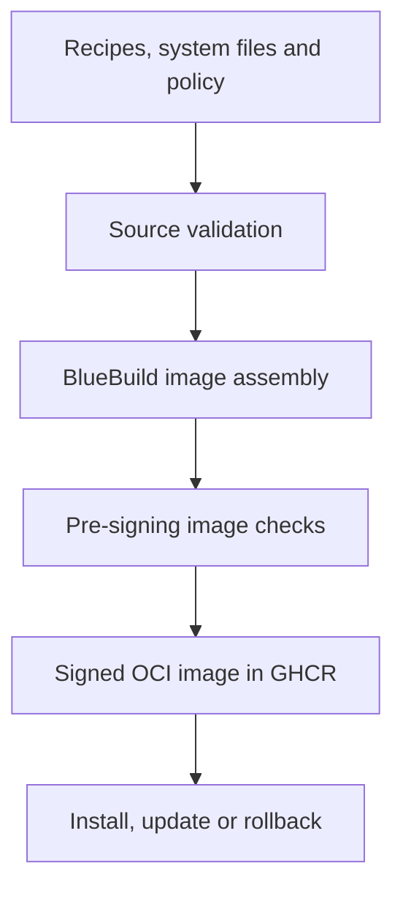

# Barq OS — Architecture

## Overview

Barq OS is a bootable, image-based Linux desktop built with BlueBuild on Fedora Kinoite and KDE Plasma. The product identity is Barq OS; Fedora remains the technical compatibility base.



Current development image:

```text
ghcr.io/barq-os/barq:latest
```

## Layers

### Host image

KDE, drivers, system services, GameMode, Gamescope, MangoHud, `steam-devices`, `ntsync-autoload`, fonts, udev rules and Barq identity belong to the host image.

### Flatpak

Steam, Heroic, ProtonUp-Qt and Flatseal are user-scoped Flatpaks so applications can update independently. Flatpak sandbox permissions and matching runtime extensions remain explicit test boundaries. The Barq Gaming launcher opens Steam's controller-first interface inside Plasma; it is not a separate DRM Gamescope session.

### User and development data

User data belongs in `/var/home`. Development tools should normally use Toolbx or Distrobox instead of permanently layering toolchains into the operating-system image.

## Update implementation

Fedora Atomic currently exposes deployment, update and rollback through `rpm-ostree`; the underlying bootable-container direction increasingly uses bootc. Documentation must describe the behavior actually present in the selected base image rather than claiming that installing either command converts a mutable Fedora system.

## Identity

`os-release` is applied near the end of the build. Barq sets the human-facing `VERSION`, `ID=barq`, `IMAGE_ID=barq`, `IMAGE_VERSION`, `LOGO=barq-os` and the Barq terminal color, while preserving `ID_LIKE=fedora` and Fedora's `VERSION_ID` for base compatibility.

The identity layer is installed after RPM packages so distro package updates cannot overwrite Barq defaults during the same build. It provides:

- Fedora 44 Plasma Login Manager defaults through `/usr/lib/plasmalogin/defaults.conf`
- a Barq Dark KDE color scheme and a minimal look-and-feel package that falls back to Breeze components
- one wallpaper shared by new Plasma sessions, PLM and the lock screen
- a short Plasma session splash
- a script-based Plymouth theme, selected before one final BlueBuild initramfs regeneration
- KInfoCenter identity through `os-release` plus `ShowBuild=true`

PLM does not support arbitrary SDDM-style QML themes. Barq therefore uses PLM's supported wallpaper and Plasma/KConfig integration instead of carrying an SDDM theme under a different name.

## Signing and Secure Boot

Cosign verifies the OCI image in the registry. UEFI Secure Boot verifies the device boot chain and kernel modules. These are separate controls; a valid image signature is not proof that local third-party modules are enrolled or trusted.

Digest-pinned verification records the image metadata, image size, `os-release` and a sorted RPM inventory as short-lived audit evidence. This evidence is not a replacement for a standards-format SBOM, Fedora advisories or vulnerability triage.

## Desktop direction

Fedora 44 KDE installations use Plasma Login Manager and Plasma Setup. Barq is PLM-first and does not ship an SDDM theme. Existing Fedora installations that deliberately retained SDDM are treated as a migration case, not as the visual baseline. Plasma Union remains experimental and is not a Barq 1.0 dependency.

Barq Welcome should complement Plasma Setup rather than duplicate accounts, networking, language or time setup. Barq Control should use an unprivileged Kirigami interface and a narrow KAuth/polkit or D-Bus helper for privileged operations. Barq Updater is deferred until a tested gap remains after Discover, Flatpak and Atomic update integration.

## Hardware

AMD and Intel follow Fedora's kernel and Mesa updates. NVIDIA must not be injected into the generic image without a separate supported recipe, driver/Secure Boot design and hardware matrix.

## Release model

Development, beta and stable channels promote the same tested digest instead of rebuilding different bits. See `RELEASE_POLICY.md` and `TEST_MATRIX.md`.

KDE is the sole 0.1 edition. Future desktops require separate recipes, images and test matrices as defined in `VARIANTS.md`; they are not installed into the KDE image.
